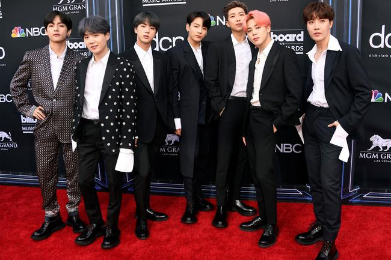

# Factors Contributing to the Successes of Different Boy Bands

## *INFO 201 "Foundational Skills for Data Science" — Winter 2022*

**Authors**: Yuntian Shi, Priya Hariharan, Simon Dey, Ryotaro Hayashi

**Link**: https://phariha.shinyapps.io/final-project-phariha/

Please create the necessary files for your multi-page Shiny app in this GitHub repository. Consult the Canvas assignment for more details. Be sure to publish your app on Shinyapps.io.

When you are finished, please add the text from your introductory and concluding pages below. You might want to use this GitHub repository as part of your digital portfolio, so you want this README.md to offer a brief description of the project and key takeaways.

Feel free to delete these instructions for your final README.md file and to make your GitHub repository public if you would like others to be able to see it.

## Introduction

The main question our group is addressing is how different factors contribute to the success of different boy bands. This question in important as the success of popular music and bands reflect the trends of the entertainment and fashion industries. To address this question, we have been examining data on various characteristics and mannerisms of 56 boy bands and drawing conclusions on what general patterns lead to their successes. Our project will include analyzing the successes of boy bands hit singles based on two different factors: the time and genre of the song as well as factoring in how the members physically look. Therefore, one of our research questions is seeing whether the dance style of the boy bands hit song follows a trend. We want to see whether there is a correlation between the dance styles throughout the 56 boy bands and whether than contributes to their songs popularity. Another research question is whether the race of the members matters in how high up their song was on the Billboard charts. Following up on that, we also want to see if their physical attributes, such as hair color and accessories, have a factor in how high up the song was in the billboard charts. This may require extra research on our end, but we also want to see when the band debuted and how quickly they were able to attain a hit on the Billboard chart. Something that motivated our questions is that boy bands have changed over the past few decades, so it's interesting to see what catches the new generations eyes. We think it's important because finding trends in pop culture is something that can be used to predict the popularity of future boy bands.

We found the data from [\*The Pudding dataset\*](https://github.com/the-pudding/data/tree/master/boybands). There were 40 people who collected this data, some being Adrian Blanco, Adriano Seghezzi, Alex Garcia, and Amanda Smith. The data was collected through five different articles written on Buzzfeed, Vogue, Billboard, Wikipedia, and Ranker. The data gathered from these sources were then verified against a Billboard chart. In regards to the physical characteristics of each member, data was collected by watching the music videos and recording characteristics through the footage. The Pudding's explanation for their data collections is to describe "ideas debated in culture with visual essays," which can also be applied to this data collection. When combining both the bands and the boys' data sets, there are 291 rows. For the bands data set, there are 7 columns while there are 10 columns for the boys data set. We don't think there are any ethical questions of power that need to be considered; if anything, one concern could be whether these bands receive different treatment based on factors like race and phenotypical characteristics. Some limitations that this data could have are that each member may look different in their various music videos, so choosing the way they look in just one may not be enough to gauge their popularity. The same can be said for their songs, because while the hits on Billboard may be a certain genre, the band itself may use alternate genres with their other songs.

Through this project, there are mainly three possible ethical questions or limitations to consider with this data set. The first challenge we might encounter is how we handle the missing data. The physical characteristics of the members were collected by watching the footage of the music videos for their top hit, but that doesn't mean it accounts for the rest of their music videos. This way of recording can lead to many data inaccuracies, as some of their outfits are not being recorded. Secondly, we may face difficulties when grouping the characteristics of the band members together. Some members may have some similar features, like sharing the same hair color, but that doesn't mean they are the same person. Finding a classification that matches all members as a whole might be challenging. Finally, it is important to look for factors other than appearance, race, and song content that could potentially affect popularity. Other factors can also affect the popularity of a band, such as the political relations at the time, society's culture, the changing tastes of the people, and so on. This is a complex problem to analyze, yet it has to be taken into account.

## Conclusion / Summary Takeaways

After we have conducted our research the trends and patterns of awarded boy bands, we successfully found out The success of various popular boy bands reflects trends in the entertainment and fashion industries in the era in which they were active. Indeed, it is assumed that the trend of boy bands that became hits in the music industry was not only the skill of singing, but also the unique worldview of each band that created a vibe that the audience preferred, as well as the design of the visual characteristics of each member of the band, which should be the most important insight that we learned from our analysis. And also, this trend will provide insight into the management that makes them a hit in the entertainment industry. If we were to conclude that that a single from a boy band was more likely to rank higher on the billboard if there was a featured artist and dancing in the music video was more upbeat than slow, label companies could use that data and incorporate more featured artists on boy band singles. Similarly, in the design and fashion facet of entertainments, if we were to conclude from our research that a band was more likely to get more listens if the lead singer had long hair, no facial hair, and more than one accessory, then designers and stylists would be able to adjust the look of their clients and create a more marketable product. In addition, most of the members of each of the supposedly successful bands we have dealt with had the same or similar characteristics in terms of clothing, hair, facial hair, etc., to each other, and such management would have succeeded in giving them their unique but unified worldview as a whole. In summary, our research has the potential to help the music and entertainment industry better understand the rational behind the fantastic success of boy bands throughout history. And as of discussion of the broader implications of this insight, if the music entertainment industry can glean from this data analysis a formula that can be used as a hit pattern to organize boy bands and make them famous, their management companies can take advantage of it: it will be possible to have a successful business in music, a field where it is called difficult to find a hit pattern.
